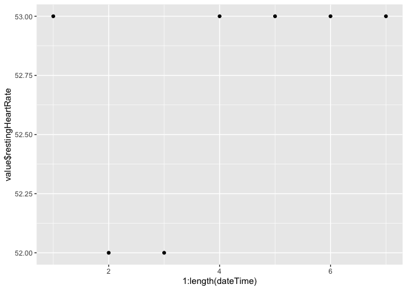
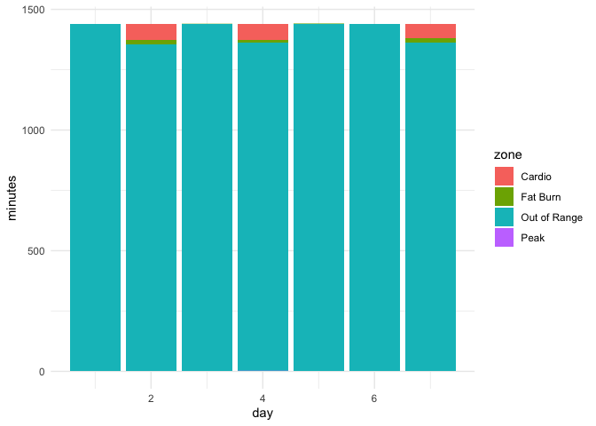

Periop Wearables: Heart Rate Data from FitBit
================
Dr Chris Tomlinson

A simple tutorial on extracting Heart Rate data from a fitbit via the
[fitbit Web API](https://dev.fitbit.com/build/reference/web-api/) using
the [fitbitr](https://github.com/teramonagi/fitbitr) from [Nagi
Teramo(teramonagi)](https://github.com/teramonagi)

## Import Data

``` r
# Load fitbit web API key into global environment
#FITBIT_KEY <- "<your OAuth 2.0 Client ID>"
#FITBIT_SECRET <- "<your Client Secret>"

# Load fitbitr library by teramonagi
# Installed via devtools::install_github("teramonagi/fitbitr")
library(fitbitr)
# Authenticate using OAuth Client ID & Secret
token <- fitbitr::oauth_token()
```

Knitting this `Rmarkdown` file poses a challenge as I don’t want to
include my OAuth credentials\! Solution is for the above chunk to not be
evaluated (`eval=FALSE`). Knitting won’t include objects stored in the
global environment, so I can’t just assign `FITBIT_KEY` &
`FITBIT_SECRET` in the console prior to knitting.

Instead I will use the chunk below to first save the token in my
environment to a file `temp_token` using `saveRDS()` function. Then on
knitting it will recall my saved temporary token to allow the `fitbitr`
functions to exectue. I will then add `temp_token`to `.gitignore` to
prevent it being published to this repository.

``` r
# Uncomment the line below to create the temporary token
#saveRDS(token, "temp_token")
token <- readRDS("temp_token")
# Also need to load fitbitr again as the above chunk was not evaluated
library(fitbitr)
```

## Heart Rate Data

The [fitbit Web API](https://dev.fitbit.com/build/reference/web-api/)
offers two levels of access to Heart Rate data. All applications can
access `Heart Rate Time Series`. This offers the temporal resolution of
1 day, returning time spent in each HR zone (Out of Range, Fat Burn,
Cardio, Peak - calculated from `HRmax = 220 - Age in Years`), along with
a resting heart rate.

Personal applications can access the *Intra*day Time Series with a
greater temporal resolution e.g. `detail-level = 1sec OR 1min`. However
this access is only granted to the data of the owner of the app only\!

Given that I would like to experiment with using the Fitbit to monitor
patient’s heart rates this is clearly not very useful\! Perhaps there is
hope though as Fitbit state that “Access to the Intraday Time Series for
all other uses is currently granted on a case-by-case basis” and that
they are “very supportive of non-profit research and personal
projects”\!

## Heart Rate Time Series

For now, we will focus on `Heart Rate Time Series`. Let’s take a look at
the structure of the data it returns for a given `date`. This will take
the form `get_heart_rate_time_series(token, date, period)`. Period may
consist of `1d, 7d, 30d, 1w, 1m`

``` r
# Set Date
date <- "2020-05-25"
hr.df <- get_heart_rate_time_series(token, date = date, period = "1w")
str(hr.df)
```

    ## 'data.frame':    7 obs. of  2 variables:
    ##  $ dateTime: chr  "2020-05-19" "2020-05-20" "2020-05-21" "2020-05-22" ...
    ##  $ value   :'data.frame':    7 obs. of  3 variables:
    ##   ..$ customHeartRateZones:List of 7
    ##   .. ..$ : list()
    ##   .. ..$ : list()
    ##   .. ..$ : list()
    ##   .. ..$ : list()
    ##   .. ..$ : list()
    ##   .. ..$ : list()
    ##   .. ..$ : list()
    ##   ..$ heartRateZones      :List of 7
    ##   .. ..$ :'data.frame':  4 obs. of  5 variables:
    ##   .. .. ..$ caloriesOut: num  2440 0 0 0
    ##   .. .. ..$ max        : int  106 134 168 220
    ##   .. .. ..$ min        : int  30 107 135 169
    ##   .. .. ..$ minutes    : int  1440 0 0 0
    ##   .. .. ..$ name       : chr  "Out of Range" "Fat Burn" "Cardio" "Peak"
    ##   .. ..$ :'data.frame':  4 obs. of  5 variables:
    ##   .. .. ..$ caloriesOut: num  2314 136 684 0
    ##   .. .. ..$ max        : int  106 133 168 220
    ##   .. .. ..$ min        : int  30 107 134 169
    ##   .. .. ..$ minutes    : int  1356 17 67 0
    ##   .. .. ..$ name       : chr  "Out of Range" "Fat Burn" "Cardio" "Peak"
    ##   .. ..$ :'data.frame':  4 obs. of  5 variables:
    ##   .. .. ..$ caloriesOut: num  2589.59 3.64 0 0
    ##   .. .. ..$ max        : int  106 133 168 220
    ##   .. .. ..$ min        : int  30 107 134 169
    ##   .. .. ..$ minutes    : int  1439 1 0 0
    ##   .. .. ..$ name       : chr  "Out of Range" "Fat Burn" "Cardio" "Peak"
    ##   .. ..$ :'data.frame':  4 obs. of  5 variables:
    ##   .. .. ..$ caloriesOut: num  2131.7 116.9 674.9 11.2
    ##   .. .. ..$ max        : int  106 134 168 220
    ##   .. .. ..$ min        : int  30 107 135 169
    ##   .. .. ..$ minutes    : int  1360 14 65 1
    ##   .. .. ..$ name       : chr  "Out of Range" "Fat Burn" "Cardio" "Peak"
    ##   .. ..$ :'data.frame':  4 obs. of  5 variables:
    ##   .. .. ..$ caloriesOut: num  2363.9 12.4 0 0
    ##   .. .. ..$ max        : int  106 134 168 220
    ##   .. .. ..$ min        : int  30 107 135 169
    ##   .. .. ..$ minutes    : int  1438 2 0 0
    ##   .. .. ..$ name       : chr  "Out of Range" "Fat Burn" "Cardio" "Peak"
    ##   .. ..$ :'data.frame':  4 obs. of  5 variables:
    ##   .. .. ..$ caloriesOut: num  2634 0 0 0
    ##   .. .. ..$ max        : int  106 134 168 220
    ##   .. .. ..$ min        : int  30 107 135 169
    ##   .. .. ..$ minutes    : int  1440 0 0 0
    ##   .. .. ..$ name       : chr  "Out of Range" "Fat Burn" "Cardio" "Peak"
    ##   .. ..$ :'data.frame':  4 obs. of  5 variables:
    ##   .. .. ..$ caloriesOut: num  2591 170 589 0
    ##   .. .. ..$ max        : int  106 134 168 220
    ##   .. .. ..$ min        : int  30 107 135 169
    ##   .. .. ..$ minutes    : int  1362 19 59 0
    ##   .. .. ..$ name       : chr  "Out of Range" "Fat Burn" "Cardio" "Peak"
    ##   ..$ restingHeartRate    : int  53 52 52 53 53 53 53

This is a slightly cumbersome format consisting of a data frame with
nested lists. We can ignore `customHeartRateZones` as this is simply a
function whereby the individual user can alter the range of their zones,
this would introduce error when comparing individuals so we can
disregard it.

### Resting Heart Rate

Let’s start by looking at Resting Heart Rate, as this is the simplest
metric and gives us a sense of how the data is structured

``` r
hr.df$value$restingHeartRate
```

    ## [1] 53 52 52 53 53 53 53

This returns an `integer vector` of resting heart rates over the
`period` specified, where `[1]` corresponds to `date - period`. Thus we
can index it to find the resting heart rate on a given day, e.g. the
second day of the period with `hr.df$value$restingHeartRate[2]`

We can visualise this with a simple plot.

``` r
library(ggplot2)
ggplot(hr.df, aes(x = 1:length(dateTime), y = value$restingHeartRate)) + geom_point()
```

<!-- -->

Not very exciting is it?\! Resting heart rate is presumably an averaged
value (over an unknown time period) so there will be a degree of
‘smoothing’ applied to these values and a 7-day period probably won’t
illustrate much. (side note [Fitbit community discussion reveals that,
as expected, it’s a proprietary secret
algorith](https://community.fitbit.com/t5/Charge-HR/How-does-Fitbit-calculate-Resting-Heart-Rate/td-p/1095262))

## Heart Rate Zones

Now that we’ve got a feel for how the data is stored we can move on to
explore the Heart Rate Zones. This will return a `list` of `length =
period` with each list item consisting of a `dataframe` with data for a
particular day, for example for the 4th day in the period.

``` r
hr.df$value$heartRateZones[4]
```

    ## [[1]]
    ##   caloriesOut max min minutes         name
    ## 1  2131.71240 106  30    1360 Out of Range
    ## 2   116.89680 134 107      14     Fat Burn
    ## 3   674.91360 168 135      65       Cardio
    ## 4    11.24856 220 169       1         Peak

The plot for this will be a little more complicated as we need to
transform our data out of list format. First we will use `rbindlist()`
from the `data.table` package to merge our list items into a single
dataframe. We could use `rbind_list()` from `dplyr` but `rbindlist()`
has a nice `idcol = TRUE` argument which will allow us to create a new
col `id` who’s value takes on the number of the list item from which the
data came from. This can then be re-named to `day`.

We will also remove to columns “caloriesOut”, “max” and “min” which are
of little interest. If we had multiple subjects they would all have
different vlaues for their “max” and “min” HR zones, but using the zone
names would allow a better relative comparison between individuals.

With multiple subjects calling the zones `name` would also be confusing,
so we’ll re-name it to `zone` which will also give an appropriate legend
description in our plot.

``` r
library(data.table)
bound <- rbindlist(hr.df$value$heartRateZones, idcol = TRUE)
# Remove cols "caloriesOut", "max" and "min"
bound <- bound[,-(2:4)]
# Rename 'ID' col to 'day' to avoid confusion if multiple subjects
names(bound)[1] <- "day"
# Rename 'name' col to 'zone'
names(bound)[3] <- "zone"
```

Now that we’ve got the data in a suitable format we can plot it. I’ve
decided to do a bar chart of minutes per day with the fill corresponding
to
zones.

``` r
ggplot(bound, aes(x = day, y = minutes, fill = zone)) + geom_bar(stat = "identity") + theme_minimal()
```

<!-- -->

Makes me feel rather lazy looking at this\! The ‘Out of Range’ label has
connotations of exceeding a maximum HR but really it means it’s below
the lower limit of ‘Fat Burn’, i.e. `HR < 50% of Predicted maxHR`.
