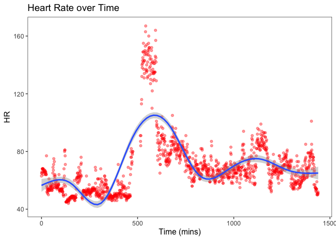
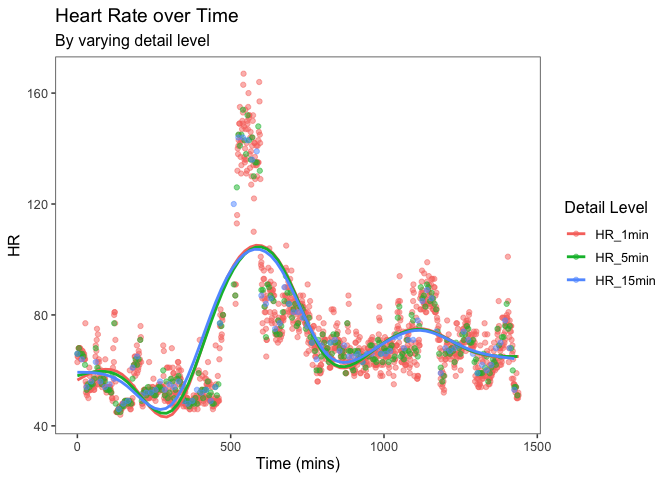

Periop Wearables: Heart Rate Data from FitBit
================
Dr Chris Tomlinson

In Part 1 we explored using the
[fitbitr](https://github.com/teramonagi/fitbitr) package from [Nagi
Teramo(teramonagi)](https://github.com/teramonagi) and the [fitbit Web
API](https://dev.fitbit.com/build/reference/web-api/) to extract **Heart
Rate Time Series** Data.

In Part 2 we will use a *Personal* application API key to access
Intraday Time Series Data, giving us heart rate data with a greater
temporal resolution e.g. detail-level = 1sec OR 1min.

## Intra-day Time Series

We will use the `get_heart_rate_intraday_time_series()` function which
has the following arguments:  
\* `date` The date, in the format `yyyy-MM-dd` or `today`.  
\* `detail_level` Number of data points to include. Either `1sec` or
`1min`. Optional.  
\* `start_time` The start of the period, in the format `HH:mm`.
Optional.  
\* `end_time` The end of the period, in the format `HH:mm`. Optional.

Let’s look at the structure of the data this function returns:

``` r
library(fitbitr)
str(get_heart_rate_intraday_time_series(token, date = date, detail_level = "1min"))
```

    ## 'data.frame':    1395 obs. of  2 variables:
    ##  $ time : chr  "00:00:00" "00:01:00" "00:02:00" "00:03:00" ...
    ##  $ value: int  63 65 65 66 68 68 68 68 68 68 ...

Pretty straightforward, we can see a `data.frame` consisting of 2
variables; a character vector `time` (from `start_time` to `end_time`,
defaulting to a 24-hour period from “00:00:00” on the `date` specified)
and an integer vector `value` corresponding to the Heart Rate for that
time.

Let’s import the data into a data.frame and rename `value` to the more
descriptive `HR`. We must also convert `time` from a character to
something more correct. Otherwise when we call `geom_smooth()` in
`ggplot` it won’t produce any result. I’ve used the `as.difftime()`
function in base R, rather than the more common `strptime()`, as it
gives me a time since midnight in units of my choice, rather than
appending the time to todays date which would introduce confusion when
analysing data from multiple
days.

``` r
df <- get_heart_rate_intraday_time_series(token, date = date, detail_level = "1min")
# Rename col 'value' to 'HR
names(df)[2] <- "HR"
# Convert time from class = character to difftime, i.e. mins since 00:00
df$time <- as.difftime(df$time, units = "mins")
```

## Plotting Intra-day Time Series

We can plot this data as a simple scatter plot in `ggplot` using
`geom_point()`. I’ve coloured it red, given the cardiac nature of the
data, and changed it’s transparency `alpha = 0.4` to improve legibility
given the close distribution of the points along the x axis.

Finally I’ve added a smoother (? correct term) using `geom_smooth()` to
aid the eye in seeing patterns given the ‘overplotting’ described above.
This defaults to `method = "gam"` with `formula = y ~ s(x, bs = "cs")`.
I don’t have the depth of mathematical knowledge to say if this is a
correct method, but visually ‘eyeballing’ the resultant line it looks
pretty appropriate to me\!

I’ve elected to show a 95% (default) Confidence Interval using the
argument `se = TRUE` . `labs()` will add a title and label the x-axis,
helping to clarify that time is in minutes as `difftime` is not the most
obvious.

``` r
library(ggplot2)
library(ggthemes)
p <- ggplot(df, aes(x = time, y = HR)) + geom_point(col = "red", alpha = 0.4) + geom_smooth(se = TRUE) + labs(title = "Heart Rate over Time", x = "Time (mins)") + theme_few()
p
```

<!-- -->

## Exploring different temporal resolutions

As described above the `get_heart_rate_intraday_time_series()` function
has an argument `detail_level` which specifies the ‘Number of data
points to include’, i.e. the temporal resolution. This can be specified
as either `1sec` (and seemingly not any other number of minutes) or
`1min`.

If we could reduce the temporal resolution even from 1 minute to 2
minutes this would halve the amount of data to process, particularly
important when we start analysing larger time periods and more than one
subject\! Clearly this will come at the expense of a loss of detail so I
thought it would be interesting to plot the same heart rate data at
different detail levels (1 min, 5 min & 15 min) and compare the results.
Particularly the smoothed line.

Unfortunately `get_heart_rate_intraday_time_series()` won’t accept a
`vector` for `detail_level` so we have to resort to separate function
calls, storing the outputs in their own data frames. We will then
`merge()` these (again unfortunately only can merge two at a time, so
have to repeat twice) into a single dataframe, using the arguments `all
= TRUE` as we don’t want to select only those time points that intersect
(this would lose the greater resolution, defeating the point of the
exercise\!). I had specified `no.dups = FALSE` although in retrospect
this is unecessary as they’re all pulling data from the same source so
the temporal resolution shouldn’t change the heart rate.

We then need to do a bit of tidying, we will rename the columns to their
`detail_level`: `"HR_1min", "HR_5min", "HR_15min"` respectively and
convert the `time` to `difftime` to allow us to perform the
`geom_smooth()` regression
line.

``` r
df.1m <- get_heart_rate_intraday_time_series(token, date = date, detail_level = "1min")
df.5m <- get_heart_rate_intraday_time_series(token, date = date, detail_level = "5min")
df.15m <- get_heart_rate_intraday_time_series(token, date = date, detail_level = "15min")

df.detail.levels <- merge(df.1m, df.5m, by = "time", all = TRUE, no.dups = FALSE)
df.detail.levels <- merge(df.detail.levels, df.15m, by = "time", all = TRUE, no.dups = FALSE)

names(df.detail.levels)[2:4] <- c("HR_1min", "HR_5min", "HR_15min")
df.detail.levels$time <- as.difftime(df.detail.levels$time, units = "mins")
```

There would be various ways of representing the resultant information. I
could produce a 1x3 panel plot. Instead I decided to follow the
principle of showing as much useful info in a single figure as possible
and instead plot a line for each `detail_level` on the same axes.

The data is currently in ‘Wide Format’:

``` r
head(df.detail.levels, 3)
```

    ##     time HR_1min HR_5min HR_15min
    ## 1 0 mins      63      66       66
    ## 2 1 mins      65      NA       NA
    ## 3 2 mins      65      NA       NA

It is easier for us to plot if we convert it into ‘Tall Format’ using
the `melt()` function in the `reshape2` package with the argument
`id.vars = "time"` to show that we are preserving time for our x-axis.

``` r
library(reshape2)
melted <- melt(df.detail.levels, id.vars = "time")
head(melted, 3)
```

    ##     time variable value
    ## 1 0 mins  HR_1min    63
    ## 2 1 mins  HR_1min    65
    ## 3 2 mins  HR_1min    65

Now we can create the plot in `ggplot` using the aesthetic `col =
variable` to colour the points by the melted column `variable` which
consists of the
`detail_level`.

``` r
ggplot(melted, aes(x = time, y = value, col = variable)) + geom_point(alpha = 0.5) + geom_smooth(aes(col = variable), se = FALSE) + labs(title = "Heart Rate over Time", subtitle = "By varying detail level", x = "Time (mins)", y = "HR", colour = "Detail Level") + theme_few()
```

<!-- -->

## Discussion

We can see the following observations:  
\* A greater detail level gives a greater range of values. This is most
significant for the higher heart rates, presumably because they are more
transient, in contrast to the low heart rates which were probably
sustained during sleep.  
\* Overall there is little difference in the averaged data between the
various detail levels.

This is all fairly intuitive and we can also be seen using the extremely
useful
    `summary()`

``` r
summary(df.detail.levels)
```

    ##      time             HR_1min          HR_5min         HR_15min     
    ##  Length:1397       Min.   : 44.00   Min.   : 45.0   Min.   : 46.00  
    ##  Class :difftime   1st Qu.: 55.00   1st Qu.: 56.0   1st Qu.: 56.00  
    ##  Mode  :numeric    Median : 66.00   Median : 66.0   Median : 66.00  
    ##                    Mean   : 69.61   Mean   : 69.7   Mean   : 69.98  
    ##                    3rd Qu.: 76.00   3rd Qu.: 75.0   3rd Qu.: 74.00  
    ##                    Max.   :167.00   Max.   :154.0   Max.   :144.00  
    ##                    NA's   :2        NA's   :1115    NA's   :1303

## Conclusions

> I would thus conclude that capturing heart rate data at 15-minute
> intervals does not result in a significant loss of detail, **provided
> we are not particularly interested in looking at the peak heart
> rates**.
